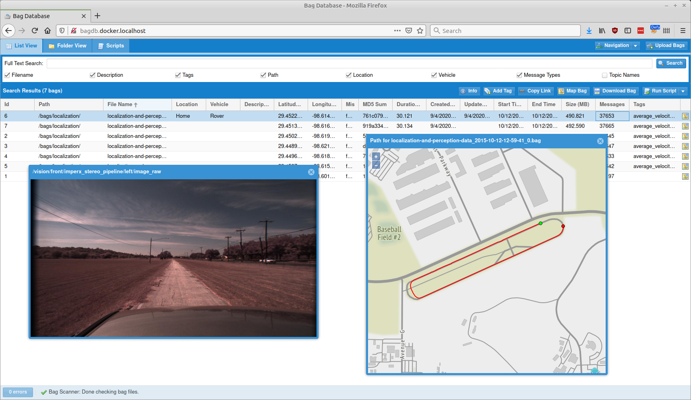

---
# Feel free to add content and custom Front Matter to this file.
# To modify the layout, see https://jekyllrb.com/docs/themes/#overriding-theme-defaults

layout: default
title: Home
nav_order: 1
description: "Bag Database main page"
permalink: /
---

# The Bag Database
   

The Bag Database is a web-based application that monitors a directory for ROS bag 
files, parses their metadata, and provides a friendly web interface for searching 
for bags, downloading them, and doing post-processing on them.

## Features

- **Directory Monitoring**: It will watch a directory for any changes and
  automatically scan any bag files placed in that directory.
- **Full-text Searching**: The Search field will search the text fields selected by the user in every
  bag file for any strings containing the provided text; it can search:
  - The bag's file name
  - The path leading to the bag on the filesystem
  - A user-provided description of the bag
  - The name of the physical location where the bag was recorded
    - (Either this must be manually entered or support for Google's reverse 
      geocoding API must be enabled)
  - The name of the vehicle
  - The types of any messages used
  - The topics published
- **Filtering**: Every column in the grid can by filtered by arbitrary values;
  click the down arrow on a column header to set a filter.
- **Folder View**: Instead of a flat list of every bag file in the database, you
  can also see them in a hierarchical view mirroring their layout on the
  filesystem which indicates how many bags are under every path and can be
  filtered by filename.
- **Displaying Metadata**: All of the same information you could obtain with 
  `rosbag info` is extracted and stored so that it can be easily viewed for any
  bag file.
- **Message Types and Topics**: You can also easily view all of the different 
  message types and topics used in the bag file.
- **Displaying GPS Coordinates**: GPS coordinates recorded in a bag file are
  extracted and stored, and you can view the path of the coordinates using
  either Bing Maps or an arbitrary WMTS tile map server.
- **Downloading**: Every bag file can be downloaded from the interface without
  needing to find it on the host filesystem.  Links to bag files can also be
  obtained by right-clicking on them.
- **Viewing Images**: You can view the first image on any sensor_msgs/Image or
  sensor_msgs/CompressedImage topic by clicking on an icon next to the topic
  in the bag details window.
- **Viewing Image Streams**: You can view any sensor_msgs/Image or
  sensor_msgs/CompressedImage topic as an embedded video stream by clicking
  on an icon next to the topic in the bag details window.
- **Tagging**: Bags can be tagged and searched for with arbitrary metadata 
  strings.  Existing tags on arbitrary metadata topics in bag files will be
  automatically read.
- **Scripting**: Users can enter scripts that can either be manually or automatically
  run on bag files to analyze them.  Scripts can also tag bag files to make it
  easy to find interesting ones or update their metadata.
- **LDAP Login**: If enabled, the bag database will authenticate users against
  an LDAP database before allowing access.  LDAP configuration details can
  be provided by customizing environment variables when starting it as a
  Docker container.  
  The Admin user is still handled separately and can log in directly by
  visiting the URL `/signin` or by loggin in as a normal user and then using
  the Navigation menu.

