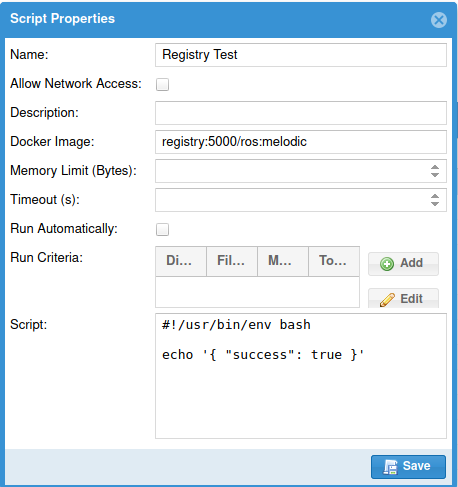

# With a Private Registry

If you want to store Docker images for running scripts locally, it makes sense to have your own
Docker registry.  It's straightforward to add a registry container to the `docker-compose.yml` file,
but keep in mind that unless you also configure it to use SSL with a valid certificate, you will
also need to configure the Bag Database's docker-in-docker container to allow it as an insecure registry.

**Note**: The [docker-java-api](https://github.com/amihaiemil/docker-java-api) library that the Bag
Database is currently using does not support authenticating with a registry.  Until support is added or
it's modified to use a different library, it will only be possible to pull images from registries that
do not require authentication.

Example `docker-compose.yml`:

```yaml
version: '3.6'
services:
    docker:
        image: docker:dind
        privileged: yes
        networks:
            - bagdb
        volumes:
            - bags:/bags:ro
            - scripts:/scripts
            - docker_cache:/var/lib/docker
            - ./daemon.json:/etc/docker/daemon.json
        command: ["dockerd", "--host=tcp://0.0.0.0:2375"]
        # SSL is disabled since only the Bag Database can access this anyway.
        # Be careful about allowing anything else to access this service! 
    registry:
        image: registry:2
        ports:
            - "5000:5000"
        volumes:
            - registry:/var/lib/registry 
    bagdb:
        image: swrirobotics/bag-database:latest
        networks:
            - bagdb
        depends_on:
            - postgres
        ports:
            - "8080:8080"
        volumes:
            - bags:/bags
            - indexes:/root/.ros-bag-database/indexes
            - scripts:/scripts
        environment:
            ADMIN_PASSWORD: "letmein"  # Change this to something more secure
            DB_DRIVER: org.postgresql.Driver
            DB_PASS: letmein  # Should match POSTGRES_PASSWORD below
            DB_URL: "jdbc:postgresql://postgres/bag_database"  # Should reference POSTGRES_DB below
            DB_USER: bag_database  # Should match POSTGRES_USER below
            DOCKER_HOST: "http://docker:2375"
            GPS_TOPICS: "/localization/gps, gps, /vehicle/gps/fix, /localization/sensors/gps/novatel/raw, /localization/sensors/gps/novatel/fix, /imu_3dm_node/gps/fix, /local_xy_origin"  # Add topics where you publish GPS coordinates
            METADATA_TOPICS: "/metadata"
            VEHICLE_NAME_TOPICS: "/vms/vehicle_name, /vehicle_name"  # Replace with a topic on which you publish your vehicle's name
    postgres:
        image: postgis/postgis:11-2.5
        networks:
            - bagdb
        volumes:
            - postgres:/var/lib/postgresql/data
        ports:
            - "5432:5432"
            # This port is exposed to make it easy for you to connect to the database with a
            # SQL client to perform operations on it.   If you don't need to do so, this
            # port does not need to be exposed.
        environment:
            POSTGRES_PASSWORD: letmein # If you do expose it, it's a good idea to change this password to something more secure.
            POSTGRES_USER: bag_database
            POSTGRES_DB: bag_database
networks:
    bagdb: {}
volumes:
    bags:
        driver: local
        driver_opts:
            type: 'none'
            o: 'bind'
            device: '/var/local/bags'  # Replace this with the path to your bags
    docker_cache:
    postgres:
    ldap:
    slapd:
    indexes:
    scripts:
        driver_opts:
            type: 'tmpfs'
            device: 'tmpfs'
```

Note that the `docker` container configuration mounts a volume at `/etc/docker/daemon.json`.  To allow
connecting to `registry:5000` insecurely, that file should contain:

```yaml
{
  "insecure-registries" : ["registry:5000"]
}
```

This configuration is otherwise the same as the example [Without Authentication](docker/without-authentication).

After starting the containers, test it by pulling an image, tagging it, pushing it to your registry,
and then running it with a script.

```bash
$ docker pull ros:melodic
melodic: Pulling from library/ros
...
Digest: sha256:9b73abfadca0246a5eb77e0e03277e6afce2a488616a0750680f5dd85dcc0516
Status: Downloaded newer image for ros:melodic
docker.io/library/ros:melodic
$ docker tag ros:melodic localhost:5000/ros:melodic
$ docker push localhost:5000/ros:melodic
The push refers to repository [localhost:5000/ros]
...
melodic: digest: sha256:828286c15eb8e624503154e8af4db1caeec181510ee2f3b94dfdb289897ea0a2 size: 2833
```

Now create and run a script that uses the image `registry:5000/ros:melodic`, and you should be able to
see it pull that image in the log file.



```
15:23:41.413 [http-nio-8080-exec-8] INFO  c.g.s.scripts.ScriptController - runScript: 10
15:23:41.431 [http-nio-8080-exec-8] DEBUG c.g.s.scripts.ScriptService - Dispatching script to executor.
15:23:41.431 [ThreadPoolTaskExecutor-1] INFO  c.g.s.scripts.RunnableScript - Starting RunnableScript task for [Registry Test]
15:23:41.432 [ThreadPoolTaskExecutor-1] DEBUG c.g.s.scripts.RunnableScript - Writing script to temporary directory: /var/lib/tomcat9/bagdb_scripts
15:23:41.440 [ThreadPoolTaskExecutor-1] INFO  c.g.s.scripts.RunnableScript - Pulling Docker image: [registry:5000/ros] with tag: [melodic]
15:23:41.451 [ThreadPoolTaskExecutor-1] DEBUG c.g.s.scripts.RunnableScript - Container config:
{"NetworkDisable":true,"Image":"registry:5000/ros:melodic","HostConfig":{"Binds":["/var/lib/tomcat9/bagdb_scripts/bagdb3030777406234527103py:/script.py","/home/preed/public_html/bags//ranger__2020-07-24-22-29-32.bag:/ranger__2020-07-24-22-29-32.bag:"]},"Cmd":["/script.py","/ranger__2020-07-24-22-29-32.bag"]}
15:23:41.480 [ThreadPoolTaskExecutor-1] DEBUG c.g.s.scripts.RunnableScript - Created container: 25a44c3c90b77033b03c57c4702baaf856bac4d59164103e5ba63469f64a47a8
15:23:41.733 [ThreadPoolTaskExecutor-1] DEBUG c.g.s.scripts.RunnableScript - Started container: 25a44c3c90b77033b03c57c4702baaf856bac4d59164103e5ba63469f64a47a8
15:23:41.768 [MessageBroker-1] DEBUG c.g.s.scripts.ScriptService - Before check: 1 scripts currently running.
15:23:41.768 [MessageBroker-1] DEBUG c.g.s.scripts.ScriptService - 1 scripts currently running.
15:23:42.097 [ThreadPoolTaskExecutor-1] DEBUG c.g.s.scripts.RunnableScript - Output:
{ 'success': true }
```
