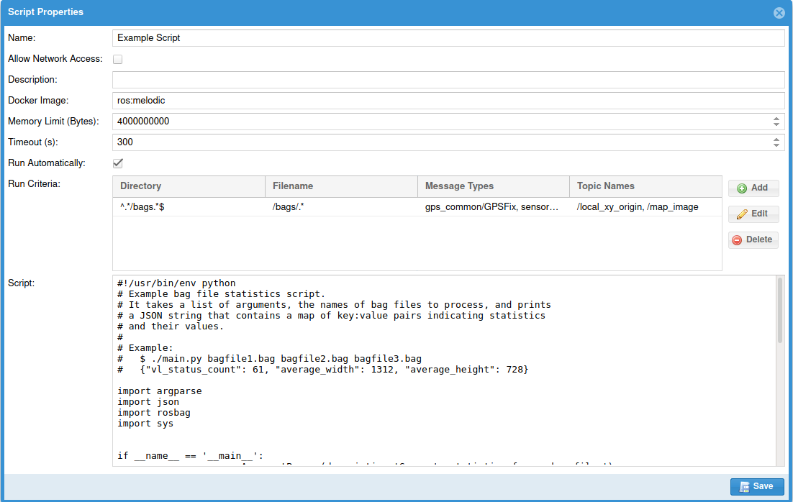

# Scripts

One of the Bag Database's most powerful features is the ability to enter arbitrary scripts
that can then be run in isolated Docker containers to perform post-processing on bag files.
Scripts can be run manually or automatically when new bag files are added.
In addition to generating statistics that will be stored in the database, these scripts can also
set tags on or update the metadata for bag files to make it easier to find interesting bags.

Consult the [Scripts](../web-interface/scripts) Web Interface documentation for details about
the UI.

## Script Fields

Exactly what makes a script?

### Name

A friendly name for the script.  This will show up in the Script Results panel to make it easy
to identify which script generated which results.

### Allow Network Access

If this is checked, the Docker container the script runs inside will be allowed to access the
network.  For security purposes, by default this is not allowed

### Description

A longer description of a script to make it easier for you to keep track of them.

### Memory Limit (Bytes)

The maximum amount of memory the script's container may use.  If it is blank or zero, there
is no limit.

### Docker Image

The name of the Docker image that the script will run inside.  This image needs to contain
all of your script's pre-requisites installed.  `ros:melodic` is a convenient one for analyzing
ROS bags, but you could make your own image with additional programs and use it instead.

### Run Automatically

If this is checked, this script will automatically run on every new bag file added to the database.

### Timeout (s)

The maximum amount of time the script's container may run before it is killed.  If this is unset
or zero, it may run forever.

### Script

The actual text content of your script.  This text area's editing functionality is very limited;
it's easiest to write your script in a proper IDE and then copy/paste it into here.

If you're storing your scripts in a source repository, you might even consider setting up a
continuous integration script to automatically push your script to the bag database when you
commit a new version.
